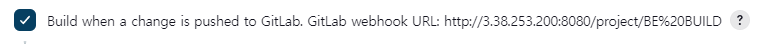
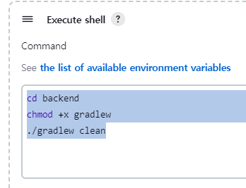
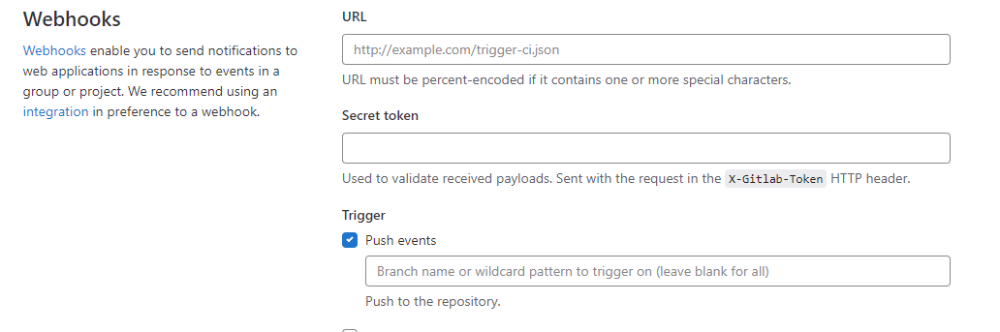

# 포팅 매뉴얼

생성 일시: February 15, 2023 9:48 AM
최종 편집 일시: February 17, 2023 2:26 AM

# SSAFY CHAT 포팅 메뉴얼

## 목차

1. 환경 설정
2. 실행 순서
3. 주의 사항
4. 기술 스택
5. 프로젝트 구조
6. 부가설명

## 1. 환경 설정

- 하드웨어 정보
    - Architecture: x86_64
    - CPU Model: Intel(R) Xeon(R) CPU E5-2686 v4 @ 2.30GHz
    - CPU family: 6
    - CPU op-mode(s): 32-bit, 64-bit
    - Socket(s): 1
    - Core(s) per socket: 4
    - Thread(s) per core: 1
    - CPU(s): 4
    - CPU MHz: 2300.167
- 소프트웨어 정보
    - OS : Ubuntu 20.04 LTS focal
    - 배포에 필요한 프로그램 : Docker version 20.10.12, build 20.10.12-0ubuntu2~20.04.1
    - 패키지 관리자 : apt 2.0.2ubuntu0.2 (amd64)

## 2. 포팅 순서

### 1.docker, docker-compose 설치

도커를 사용하여 서비스를 배포하기 때문에 프레임워크, 라이브러리 등 추가 설치 할 필요 없습니다. 

여러 도커 컨테이너를 관리하는데 편리한 docker-compose를 사용해서 프로젝트를 배포합니다.

1. 리눅스 패키지 업데이트
    
    ```
    $ sudo apt update
    ```
    
2. Docker 설치를 위한 패키지 설치
    
    ```
    $ sudo apt install apt-transport-https ca-certificates curl gnupg lsb-release
    ```
    
3. Docker 공식 GPG키 추가
    
    ```
    $ curl -fsSL <https://download.docker.com/linux/ubuntu/gpg> | sudo gpg --dearmor -o /usr/share/keyrings/docker-archive-keyring.gpg
    ```
    
4. Docker 저장소 추가
    
    ```
    $ echo "deb [arch=amd64 signed-by=/usr/share/keyrings/docker-archive-keyring.gpg] <https://download.docker.com/linux/ubuntu> $(lsb_release -cs) stable" | sudo tee /etc/apt/sources.list.d/docker.list > /dev/null
    ```
    
5. Docker 설치
    
    ```
    $ sudo apt update
    $ sudo apt install docker-ce docker-ce-cli containerd.io
    ```
    
6. Docker 서비스 실행
    
    ```
    $ sudo systemctl start docker
    $ sudo systemctl enable docker
    ```
    
7. Docker 버전 확인
    
    ```
    $ docker --version
    ```
    
8. Docker Compose 설치
    
    ```
    $ sudo curl -L "<https://github.com/docker/compose/releases/download/1.29.2/docker-compose-$>(uname -s)-$(uname -m)" -o /usr/local/bin/docker-compose
    $ sudo chmod +x /usr/local/bin/docker-compose
    $ docker-compose --version
    ```
    
    ```
    $ sudo curl -L "<https://github.com/docker/compose/releases/download/1.29.2/docker-compose-$>(uname -s)-$(uname -m)" -o /usr/local/bin/docker-compose
    $ sudo chmod +x /usr/local/bin/docker-compose
    $ docker-compose --version
    ```
    

### 2. init-letsencrypt.sh 파일 수정 및 실행

init-letsencrypt.sh 파일은 certbot, nginx을 활용한 SSL 설정을 위한 파일을 생성하는 실행 파일입니다.
domain, data_path, email에 대한 값을 수정하고 ./init-letsencrypt.sh 명령어를 실행합니다.

### 3.  프로젝트.env 환경변수 값 수정

각 프로젝트에 ~.env 파일들이 존재합니다. docker-compose.yml파일에서 주입할 환경 변수 값들을 수정합니다.
docker-compose config 명령어를 사용해서 기입한 환경 변수들에 대한 docker-compose 환경을 확인할 수 있습니다.

### 4. docker-compose 실행

다음 명령어를 입력합니다.

```
$ docker-compose up #-d 옵션을 사용하면 로그출력없이 bg에서 실행
```

프로젝트를 중지하고자 한다면 다음 명령어를 수행합니다.

```
$ docker-compose stop # stop대신 down을 사용하면 컨테이너가 중지되고 삭제
```

### 5. 젠킨스 설정 (선택)

jenkins폴더로 이동하여 다음 명령어를 실행합니다.

```
$ docker-compose up -d 
```

필요에 따라 push에 맞춰 빌드, 혹은 자동배포에 젠킨스를 활용할 수 있습니다. 

접속경로는 http://도메인:8100 이며 [https://www.jenkins.io/doc/book/using/](https://www.jenkins.io/doc/book/using/) 에서 젠킨스 사용법을 알 수 있습니다.

ex) 특정 브랜치 자동빌드 예시 

1. 젠킨스의 FreeStyle project를 생성
2. 소스 코드에서 Git을 설정하고 자신의 프로젝트, 계정(Credentials)를 기입 
3. Branch Specifier에서 자동빌드하고자 하는 브랜치 설정 ex) */BE
4. “빌드 유발” 속성에서 **Build when a change is pushed to GitLab와 필요 이벤트 체크(옆의 gitLab webhook URL기억)**

5.  “**Build Steps” 속성에서 다음과 같이 기입** 



1. GitLab에서 Webhook 설정 



Jenkins에서 **gitLab webhook URL 값을 URL에 기입, Jenkins의 “빌드 유발”의 고급 속성에서 Secret token값을 GitLab의 Secret token에 기입**

이후 선택한 브랜치에 push가 발생하면 자동 빌드가 되는 것을 확인할 수 있습니다.

## 3. 주의 사항

1. docker, docker-compose는 아키텍처, 운영체제 등에 따라 설치 코드가 다를 수 있으니 적절한 버전을 선택하세요.
2. 기본적으로 도커를 실행하려면 root계정 권한이 필요합니다. 일반 계정에서 도커를 사용하고자 한다면 도커를 사용할 수 있는 그룹에 사용자를 추가해야 합니다. 그룹에 사용자를 추가하고자 한다면 다음 명령어를 입력합니다.

```
$ sudo usermod -aG docker 유저계정
```

1. 도커 설정 등에 의해서 Permission definded 에러가 나온다면 다음 명령어를 프로젝트에 적용하세요.

```
$ chown -R 사용자계정 프로젝트root폴더
```

## 4. 기술 스택 & 개발환경

**Backend - Spring, node.js**

- IntelliJ IDE 2022.3.1
- SpringBoot Gradle 2.7.5
- Spring Data JPA
- Spring Security
- JWT
- Lombok
- Redis 3.0.504
- MySQL 8.0.30
- MongoDB 6.0.4
- Postman
- Swagger 3.0.0
- node v18.13.0

**Frontend - React, TypeScript**

- Visual Studio Code IDE
- React 18.0.2
- React-Dom 18.0.2
- Redux 8.0.5
- Socket.io-Client 4.5.4
- TypeScript 4.9.4
- node v18.13.0

**CI/CD**

- AWS EC2
- Jenkins
- NGINX
- Docker
- SSL (certbot)

## 5. 프로젝트 구조

```
S08P12A604/
├── README.md
├── backend # 핵심 CRUD 서버(Spring boot)
│   ├── Dockerfile
│   ├── backend.env
│   ├── build.gradle
│   ├── gradle
│   │   └── wrapper
│   │       ├── gradle-wrapper.jar
│   │       └── gradle-wrapper.properties
│   ├── gradlew
│   ├── gradlew.bat
│   ├── settings.gradle
│   └── src
│       ├── main
│       │   ├── java
│       │   │   └── com
│       │   │       └── ssafychat
│       │   │           ├── BackendApplication.java
│       │   │           ├── domain
│       │   │           │   ├── chat
│       │   │           │   │   └── chat.txt
│       │   │           │   ├── member
│       │   │           │   │   ├── controller
│       │   │           │   │   │   ├── LoginController.java
│       │   │           │   │   │   └── MemberController.java
│       │   │           │   │   ├── dto
│       │   │           │   │   │   ├── MemberDto.java
│       │   │           │   │   │   ├── MyPageDto.java
│       │   │           │   │   │   ├── PossibleMentoringDto.java
│       │   │           │   │   │   ├── ProfileDto.java
│       │   │           │   │   │   └── TokenInfoDto.java
│       │   │           │   │   ├── exception
│       │   │           │   │   │   └── ErrorCode.java
│       │   │           │   │   ├── model
│       │   │           │   │   │   └── Member.java
│       │   │           │   │   ├── repository
│       │   │           │   │   │   └── MemberRepository.java
│       │   │           │   │   └── service
│       │   │           │   │       ├── MemberDetailsImpl.java
│       │   │           │   │       ├── MemberService.java
│       │   │           │   │       └── MemberServiceImpl.java
│       │   │           │   ├── mentoring
│       │   │           │   │   ├── controller
│       │   │           │   │   │   └── MentoringController.java
│       │   │           │   │   ├── dto
│       │   │           │   │   │   ├── ApplyMentoringDto.java
│       │   │           │   │   │   ├── ApplyMentoringForMentorDto.java
│       │   │           │   │   │   ├── ApplyMentoringViewDto.java
│       │   │           │   │   │   ├── CancelReasonDto.java
│       │   │           │   │   │   ├── CanceledMentoringListDto.java
│       │   │           │   │   │   ├── CheckMentoringReservationForMenteeDto.java
│       │   │           │   │   │   ├── MainInfoDto.java
│       │   │           │   │   │   ├── MatchMentoringForMentorDto.java
│       │   │           │   │   │   ├── MentoringDateDto.java
│       │   │           │   │   │   ├── MentoringDto.java
│       │   │           │   │   │   ├── MentoringListForMenteeDto.java
│       │   │           │   │   │   ├── MentoringListForMentorDto.java
│       │   │           │   │   │   ├── MyPageCompleteDto.java
│       │   │           │   │   │   ├── MyPageMatchDto.java
│       │   │           │   │   │   ├── RankerDto.java
│       │   │           │   │   │   ├── ReviewAndScoreDto.java
│       │   │           │   │   │   └── RollingPaperDto.java
│       │   │           │   │   ├── exception
│       │   │           │   │   │   └── MentoringException.java
│       │   │           │   │   ├── model
│       │   │           │   │   │   ├── ApplyMentoring.java
│       │   │           │   │   │   ├── CancelMentoring.java
│       │   │           │   │   │   ├── CompleteMentoring.java
│       │   │           │   │   │   ├── Mentoring.java
│       │   │           │   │   │   ├── MentoringDate.java
│       │   │           │   │   │   ├── MentoringDateInterface.java
│       │   │           │   │   │   ├── Report.java
│       │   │           │   │   │   └── ReportInterface.java
│       │   │           │   │   ├── repository
│       │   │           │   │   │   ├── ApplyMentoringRepository.java
│       │   │           │   │   │   ├── CancelMentoringRepository.java
│       │   │           │   │   │   ├── CompleteMentoringRepository.java
│       │   │           │   │   │   ├── MentoringDateRepository.java
│       │   │           │   │   │   ├── MentoringRepository.java
│       │   │           │   │   │   └── ReportRepository.java
│       │   │           │   │   └── service
│       │   │           │   │       ├── MentoringService.java
│       │   │           │   │       └── MentoringServiceImpl.java
│       │   │           │   └── webRTC
│       │   │           │       └── webRTC.txt
│       │   │           └── global
│       │   │               ├── config
│       │   │               │   ├── RedisConfig.java
│       │   │               │   ├── SwaggerConfig.java
│       │   │               │   └── WebSecurityConfig.java
│       │   │               ├── jwt
│       │   │               │   ├── JwtAuthenticationFilter.java
│       │   │               │   └── JwtTokenProvider.java
│       │   │               └── util
│       │   │                   ├── DateToStringConverter.java
│       │   │                   └── Util.java
│       │   └── resources
│       │       └── application.properties
│       └── test
│           └── java
│               └── com
│                   └── ssafychat
│                       └── BackendApplicationTests.java
│
│
│
├── backend_chatting # WebRTC와 멘토링 채팅 관련 서버(Node.js Express)
│   ├── Dockerfile
│   ├── babel.config.json
│   ├── mongoose
│   │   ├── model.js
│   │   └── schemas
│   │       ├── chatting.js
│   │       └── index.js
│   ├── node.env
│   ├── nodemon.json
│   ├── package-lock.json
│   ├── package.json
│   └── src
│       └── server.js
│
│
├── data # nginx 설정폴더
│   └── nginx
│       └── app.conf
│
│
├── db # Mysql, 몽고DB 관련 폴더
│   ├── MYSQL
│   │   ├── Dockerfile
│   │   └── ERD
│   │       └── model.mwb
│   ├── mongodb
│   │   └── docker-entrypoint-initdb.d
│   │       └── mongo-init.sh
│   ├── mongodb.env
│   └── mysql.env
│
│
├── front # React
│   ├── Dockerfile
│   ├── README.md
│   ├── front.env
│   ├── package-lock.json
│   ├── package.json
│   ├── public
│   │   ├── favicon.ico
│   │   ├── img/ #이미지 폴더
│   │   ├── index.html
│   │   ├── manifest.json
│   │   └── robots.txt
│   ├── src
│   │   ├── App.css
│   │   ├── App.test.tsx
│   │   ├── App.tsx
│   │   ├── api # axios 모듈
│   │   │   ├── applying.ts
│   │   │   ├── chatting.ts
│   │   │   ├── http.ts
│   │   │   ├── mentoring.ts
│   │   │   ├── mongo.ts
│   │   │   ├── review.ts
│   │   │   └── user.ts
│   │   ├── assets/ #이미지 폴더
│   │   ├── components
│   │   │   ├── PrivateRoute.tsx
│   │   │   ├── ProtectRoute.tsx
│   │   │   ├── PublicRoute.tsx
│   │   │   ├── README.md
│   │   │   ├── applying
│   │   │   │   ├── MentoringSearchForm.tsx
│   │   │   │   └── MentoringSearchResult.tsx
│   │   │   ├── chat
│   │   │   │   └── Chat.tsx
│   │   │   ├── common
│   │   │   │   ├── Banner.tsx
│   │   │   │   ├── CardBanner.tsx
│   │   │   │   ├── CardList.tsx
│   │   │   │   ├── CountBanner.tsx
│   │   │   │   ├── MentorRanking.tsx
│   │   │   │   ├── MentoringList.tsx
│   │   │   │   ├── MypageCalendar.tsx
│   │   │   │   └── Profile.tsx
│   │   │   ├── meeting
│   │   │   │   └── Meeting.tsx
│   │   │   ├── mentoring
│   │   │   │   ├── ReservedCardList.tsx
│   │   │   │   └── ReservedList.tsx
│   │   │   ├── modal
│   │   │   │   ├── ApplyingModal.tsx
│   │   │   │   ├── CancelModal.tsx
│   │   │   │   └── ReviewModal.tsx
│   │   │   ├── rollingpaper
│   │   │   │   ├── RollingCardList.tsx
│   │   │   │   └── rollingpaper.tsx
│   │   │   └── user
│   │   │       ├── Join.tsx
│   │   │       └── Login.tsx
│   │   ├── config
│   │   │   └── README.md
│   │   ├── constants
│   │   │   ├── README.md
│   │   │   └── copyright.ts
│   │   ├── container
│   │   │   ├── ApplyingContainer.tsx
│   │   │   ├── MainContainer.tsx
│   │   │   ├── MentorReservationContainer.tsx
│   │   │   ├── MyPageContainer.tsx
│   │   │   ├── ReservationContainer.tsx
│   │   │   └── VideoConferenceContainer.tsx
│   │   ├── context
│   │   │   └── README.md
│   │   ├── hooks
│   │   │   ├── README.md
│   │   │   └── hooks.ts
│   │   ├── index.css
│   │   ├── index.tsx
│   │   ├── layout
│   │   │   ├── Footer.tsx
│   │   │   ├── Header.tsx
│   │   │   └── Layout.tsx
│   │   ├── logo.svg
│   │   ├── pages
│   │   │   ├── BannerPage.tsx
│   │   │   ├── MainPage.tsx
│   │   │   ├── README.md
│   │   │   └── UserPage.tsx
│   │   ├── react-app-env.d.ts
│   │   ├── reportWebVitals.ts
│   │   ├── services
│   │   │   └── README.md
│   │   ├── setupTests.ts
│   │   ├── store
│   │   │   ├── applyingSlice.ts
│   │   │   ├── counterSlice.ts
│   │   │   ├── mentoringSlice.ts
│   │   │   ├── rollingSlice.ts
│   │   │   ├── store.ts
│   │   │   └── userSlice.ts
│   │   ├── styles
│   │   │   ├── README.md
│   │   │   ├── components
│   │   │   │   ├── applying
│   │   │   │   │   ├── mentoring-search-form.css
│   │   │   │   │   └── mentoring-search-result.css
│   │   │   │   ├── chat
│   │   │   │   │   └── Chat.css
│   │   │   │   ├── common
│   │   │   │   │   ├── banner.css
│   │   │   │   │   ├── card-banner.css
│   │   │   │   │   ├── card-list.css
│   │   │   │   │   ├── count-banner.css
│   │   │   │   │   ├── mentor-ranking.css
│   │   │   │   │   ├── mentoring-list.css
│   │   │   │   │   ├── mypage-calendar.css
│   │   │   │   │   └── profile.css
│   │   │   │   ├── footer.css
│   │   │   │   ├── header.css
│   │   │   │   ├── mentoring
│   │   │   │   │   ├── reserved-card-list.css
│   │   │   │   │   └── reserved-list.css
│   │   │   │   ├── modal
│   │   │   │   │   ├── applying-modal.css
│   │   │   │   │   ├── cancel-modal.css
│   │   │   │   │   └── review-modal.css
│   │   │   │   ├── rollingpaper
│   │   │   │   │   ├── rolling-card-list.css
│   │   │   │   │   └── rollingpaper.css
│   │   │   │   └── user
│   │   │   │       └── sign_in_up.css
│   │   │   ├── container
│   │   │   │   ├── applying-container.css
│   │   │   │   ├── mentor-reservation-container.css
│   │   │   │   ├── mypage-container.css
│   │   │   │   ├── reservation-container.css
│   │   │   │   └── video-conference-container.css
│   │   │   ├── pages
│   │   │   │   └── main-page.css
│   │   │   └── widget
│   │   │       ├── Chat-Widget.css
│   │   │       ├── applying-card.css
│   │   │       ├── arrow-button.css
│   │   │       ├── calendar.css
│   │   │       ├── mentoring-chat.css
│   │   │       ├── messages.css
│   │   │       ├── ranking-card.css
│   │   │       ├── reservation-card.css
│   │   │       ├── reserved-card.css
│   │   │       └── sticky-style.css
│   │   ├── utils
│   │   │   ├── README.md
│   │   │   └── ts
│   │   │       ├── date_to_string.ts
│   │   │       └── move.ts
│   │   └── widget
│   │       ├── ApplyingCard.tsx
│   │       ├── ArrowButton.tsx
│   │       ├── Chat-Widget.tsx
│   │       ├── InputIcon.tsx
│   │       ├── InputText.tsx
│   │       ├── InputTextBox.tsx
│   │       ├── MentoringChat.tsx
│   │       ├── Messages.tsx
│   │       ├── README.md
│   │       ├── RankingCard.tsx
│   │       ├── ReservationCard.tsx
│   │       ├── ReservedCard.tsx
│   │       └── Sticky.tsx
│   └── tsconfig.json
│
├── docker-compose.yml #도커 컨테이너 관련 컴포즈 설정파일
├── init-letsencrypt.sh # CertBot 관련 설정 쉘파일
└── jenkins # 자동빌드용 젠킨스 실행
    └── docker-compose.yml

```
## 6. 부가 설명

1. Mysql 더미파일 : ssafychat_dump.sql
